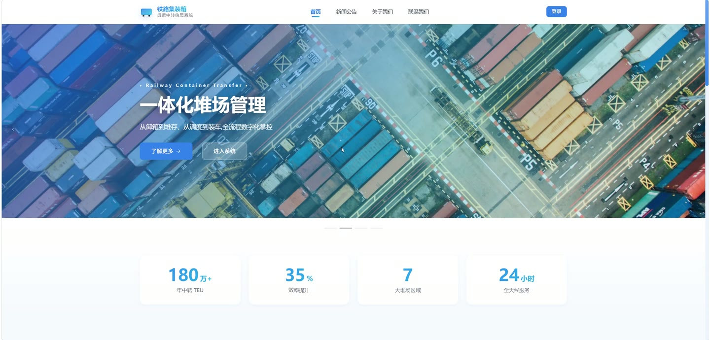
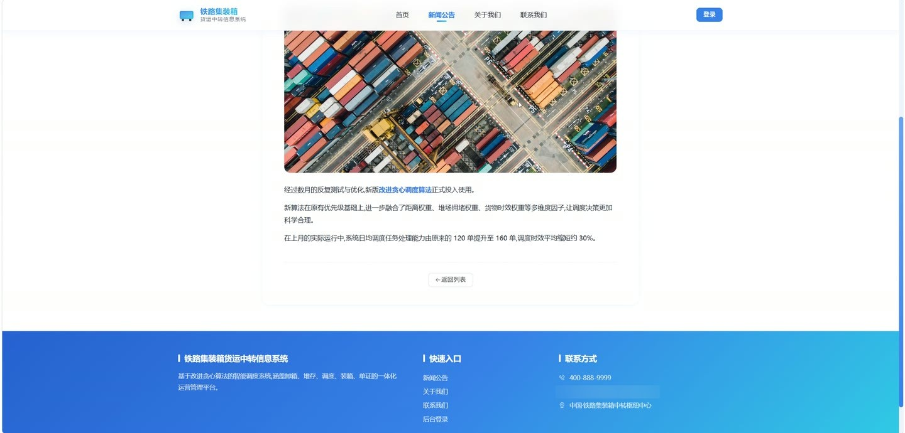
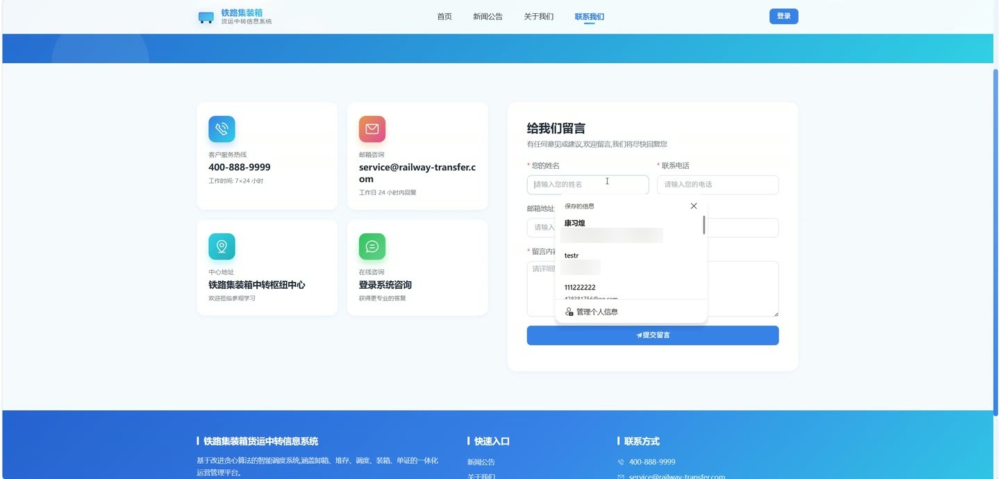
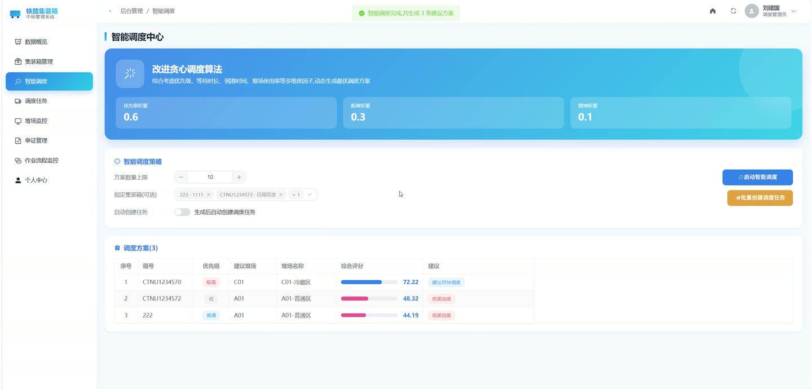
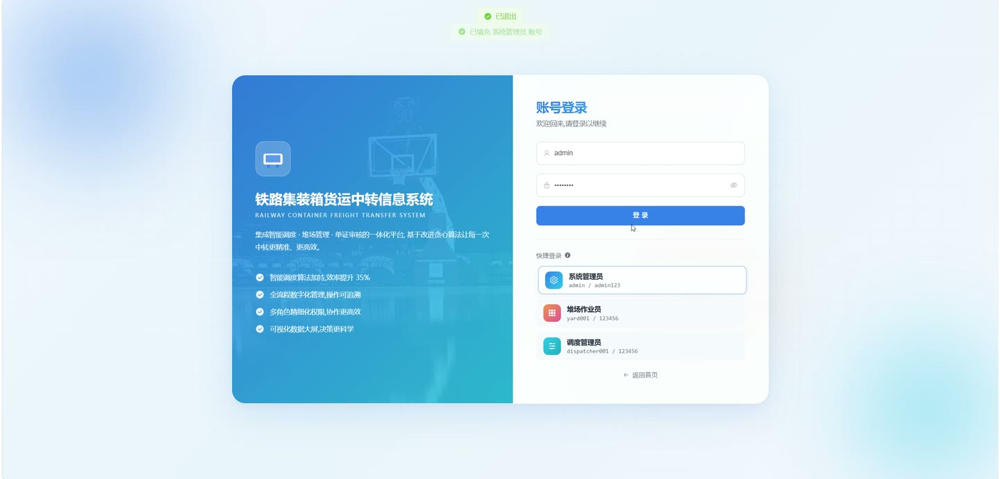
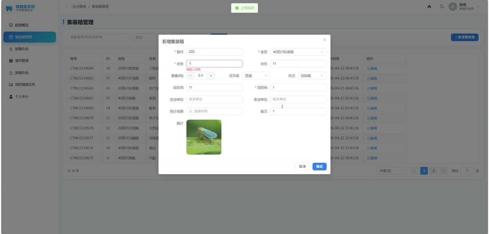

# (附文档)Python+Flask+Vue3 铁路集装箱货运中转信息系统

**技术栈**：Python、Flask、Vue3、MySQL

### 系统简介

本系统是一套基于 Python Flask 与 Vue3 前后端分离架构的铁路集装箱货运中转信息管理平台，围绕集装箱从到达、卸箱、堆存、调度到装箱发运的全流程进行数字化管理。系统内置改进贪心算法的智能调度引擎，支持管理员、堆场作业员、调度管理员三类角色，各角色登录后按权限进入对应工作台。
 
### 核心功能
 
### 管理员端

 
- 用户管理：新增、编辑、删除系统用户，维护账号、真实姓名、角色、手机号、邮箱、性别与启用状态。 
- 集装箱类型管理：按类型编码、名称维护 20GP 等箱型，录入长宽高、最大载重、容积与描述信息。 
- 堆场区域管理：维护区域编码、名称、容量、当前占用、位置、区域类型与状态，自动计算使用率。 
- 作业参数管理：配置 priority_weight、distance_weight、congestion_weight 等调度权重参数，按通用/作业/堆存/调度/监控/系统分类。 
- 轮播图管理：维护首页轮播图的图片、标题、副标题、跳转链接、排序号与启用状态。 
- 公告新闻管理：发布新闻动态、公告、行业资讯，设置封面、摘要、正文、作者、置顶与上下架状态。 
- 运营数据大屏：查看集装箱总量、调度任务总数、调度准点率与平均耗时、堆场使用率等核心指标。 
- 统计图表：查看近 7 天业务吞吐趋势、集装箱状态分布、货类分布、各堆场使用率与目的地 TOP10。 
- 系统日志：按用户名、操作、URL、日志类型、状态检索日志，查看请求参数与错误信息，支持一键清空。
 
### 堆场作业员端

 
- 集装箱管理：登记箱号、箱型、货类、货名、重量、起运地、目的地、发货人、收货人、到达时间与优先级。 
- 卸箱作业：创建卸箱记录，关联集装箱、作业人员、卸箱时间与使用设备，生成唯一记录编号。 
- 堆存管理：为集装箱分配堆场区域与贝位，记录排、列、层坐标、堆存时间与操作人员。 
- 装箱作业：创建装箱记录，关联集装箱、调度任务、车次与装箱时间，回填集装箱状态。 
- 我的调度任务：查看指派给本人的调度任务，更新任务实际执行时间与执行状态。 
- 单证管理：查看与本人相关的单证信息，跟踪单证审核状态与审核意见。
 
### 调度管理员端

 
- 智能调度：基于优先级、距离、拥堵权重参数运行改进贪心算法，自动生成调度任务并计算评分。 
- 调度任务管理：维护任务编号、起始区域、目标区域、优先级、计划时间、调度人与执行人。 
- 堆场监控：实时查看各堆场区域容量、当前占用与使用率，识别高负载区域。 
- 单证管理：创建提箱单、装箱单等单证，提交审核并查看审核人与审核备注。 
- 作业流程监控：跟踪集装箱从卸箱、堆存到装箱的全链路作业进度与状态流转。 
- 集装箱管理：查看全部集装箱信息，按状态、目的地等条件筛选跟踪货物动向。
 
### 前台门户

 
- 首页：展示轮播图、系统简介与核心业务入口。 
- 新闻公告：浏览新闻动态、公告与行业资讯列表，进入详情页查看正文与浏览量。 
- 关于我们、联系我们：展示平台介绍与联系方式。 
- 账号登录：支持账号密码登录，提供管理员、堆场作业员、调度管理员快捷填充入口。
 
### 技术栈

 后端框架Python + Flask ORMFlask-SQLAlchemy 权限控制基于角色的路由守卫与接口鉴权（admin / yard / dispatcher） 前端框架Vue3（组合式 API） UI 组件库Element Plus 状态管理Pinia 路由Vue Router（Hash 模式） 构建工具Vite 图表库ECharts（vue-echarts） 数据库MySQL
 
### 交付内容

 
- 后端完整源码 
- 前端完整源码 
- 数据库初始化脚本 
- 万字文档

## 界面展示

---

## 获取完整源码 + 万字文档

本仓库为项目介绍页。**完整前后端源码、数据库初始化脚本、万字项目文档**，请加微信 `kangkangcode`，或访问 [codekk.top](http://codekk.top) 获取。

可作课程设计 / 毕业设计参考，支持远程部署调试。